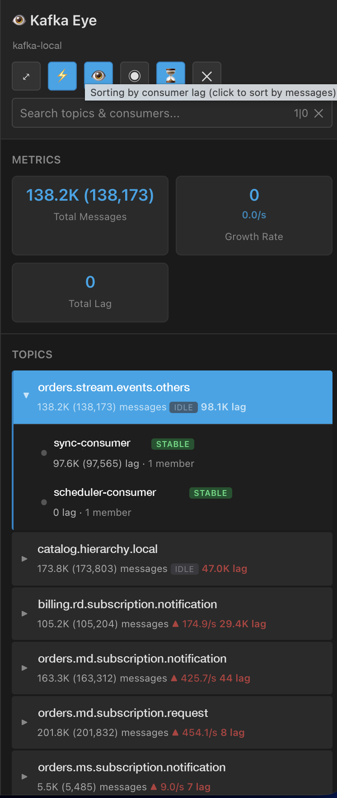

# 👁️ Kafka Eye v1.3.1

**Real-time Kafka monitoring for Kafka UI (Kafbat)**

<p align="center">
  
</p>

<p align="center">
  <em>Lag-sort mode (⏳): topics ordered by outstanding consumer lag, with the top
  topic expanded to show its consumer groups. Names are illustrative.</em>
  <br>
  <strong>📸 <a href="docs/SNAPSHOTS.md">See more snapshots →</a></strong>
</p>

## How it works

1. **Automatically detects cluster** from your Kafka UI URL
2. **Uses the Kafka UI API** — no page scraping
3. **Updates every 15 seconds** (3 seconds in Fast mode)

## Installation

```bash
git clone https://github.com/Julio-Duarte-Rodrigues/kafka-eye.git
```

1. Go to `brave://extensions` (or `chrome://extensions` / `edge://extensions`)
2. Enable **Developer mode**
3. Click **Load unpacked**
4. Select the cloned folder (the one containing `manifest.json`)
5. Refresh your Kafka UI page

After changing the code, hit **Reload** on the extension card. Open Kafka UI
tabs re-inject themselves automatically — no manual page refresh needed.

See [INSTALL.md](INSTALL.md) for details.

## Toolbar controls

| Button | Meaning |
| --- | --- |
| ⤢ | Collapse / expand the sidebar |
| ⚡ | Fast mode (3s polling instead of 15s) |
| 🙈 / 👁️ | Show non-empty topics only |
| ◉ | Show selected topics only |
| 👥 | **Hide topics and consumers with zero lag** |
| ⇅ / ⏳ | **Sort by messages / sort by consumer lag** |
| ✕ | Close |

## Hiding zero-lag topics and consumers

Click **👥** to hide topics and consumer groups that currently have no
outstanding lag. A topic is hidden when its consumer data has been fetched and
its total lag is `0`; consumer rows with `0` lag are hidden individually.

Topics not yet scanned stay visible with `scanning…` until Kafka Eye has a
result. Unknown data is never treated as zero, so items do not disappear just
because they have not been checked yet. The setting is remembered between
sessions and composes with search, non-empty, and selected-only filters.

## Sorting by consumer lag

Click **⇅** to switch the topic list from *messages* to *consumer lag* (the icon
becomes **⏳**). The choice is remembered between sessions.

Kafka UI only exposes consumer groups **per topic**, so lag is not known for a
topic until it has been queried. In lag mode Kafka Eye backfills that data in the
background at **one topic per poll**, so the list re-sorts progressively as
results arrive:

- Topics with known lag sort **highest lag first**
- Topics not yet scanned show `scanning…` and sit at the bottom
- A topic with **zero** lag still ranks above an unscanned one — unknown is not
  treated as zero

The scan is deliberately throttled and shares the same one-request-at-a-time
mutex and failure backoff as every other consumer request. Fanning out here
would exhaust the browser's per-host connection pool and break the topics fetch.
Scanning is capped at the top 60 visible topics by message count.

## Features

- ✅ Topic list with message counts and per-topic throughput (`▲ 1.2K/s`)
- ✅ Inline accordion: click a topic to expand its consumer groups
- ✅ Sort by message count or by consumer lag
- ✅ Consumer health badges (STABLE / EMPTY / DEAD / REBAL) and member counts
- ✅ Lag trend, sparkline and ETA-to-zero for the selected consumer
- ✅ Idle topic detection
- ✅ Metrics scoped to the current selection
- ✅ Search across topics and consumers (debounced)
- ✅ Fast / standard polling modes
- ✅ Auto-recovers after an extension reload — no page refresh needed

## Number formatting

Long scale, not US convention:

| Suffix | Value |
| --- | --- |
| `K` | 10³ |
| `M` | 10⁶ |
| `KM` | 10⁹ (thousands of millions) |
| `B` | 10¹² |

## Debug

Open the browser console (F12) and filter for `[Kafka Eye]` to see the detected
cluster, API URLs, topic/consumer counts and any fetch errors. See `DEBUG.md`.

## What the topic row numbers mean

A row like `380.3K (380,309) messages ▲ 72.2/s  101.7K lag` reads as:

| Part | Meaning |
| --- | --- |
| `380.3K (380,309) messages` | Total messages in the topic — the sum of `offsetMax` across all partitions. Compact form plus the exact count. |
| `▲ 72.2/s` | Throughput — messages per second, trending up. Least-squares slope over the last 20 polls, so one spike won't skew it. |
| `101.7K lag` | Consumer lag — messages produced but not yet consumed, summed across every consumer group on the topic. Red when non-zero, green at zero. Shown in lag-sort mode; it's the value the list is ordered by. |
| `idle` | No new messages over the last 3 polls. |

Every one of these has a hover tooltip in the sidebar explaining it in place.

## Privacy

Kafka Eye talks only to the Kafka UI origin you already have open, using its
REST API. No data is sent anywhere else, and the only stored state is your UI
preferences (`chrome.storage`) plus a message-count sample in `localStorage`.

## License

MIT — see [LICENSE](LICENSE).
