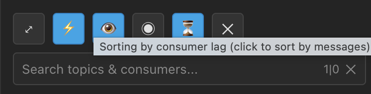
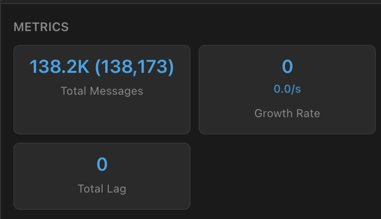
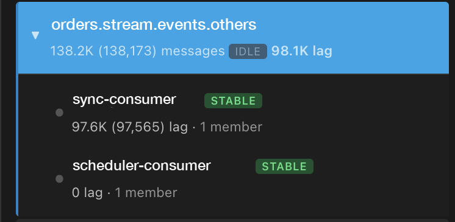
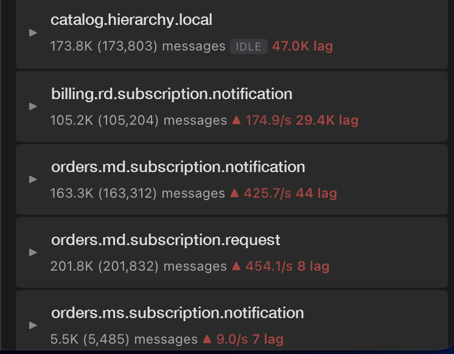

# 📸 Kafka Eye — Snapshots

A visual tour of the sidebar. Topic, consumer and cluster names in these images
are illustrative — they don't come from a real cluster.

---

## Full sidebar

The whole panel in lag-sort mode: metric cards up top, then the topic list
ordered by outstanding consumer lag, with the first topic expanded.

  

---

## Toolbar

  

Left to right: collapse (**⤢**), fast mode (**⚡**, 3s polling), non-empty topics
only (**👁️**), selected only (**◉**), sort mode (**⏳** = by consumer lag), close
(**✕**). Active toggles are highlighted blue.

Every control and every metric has a hover tooltip — shown here explaining the
current sort mode. The `1|0` counter tracks selected topics and consumers.

---

## Metrics

  

Scoped to the current selection, so selecting a topic narrows all three to that
topic. **Growth Rate** shows the change since the last poll plus the equivalent
per-second rate, coloured red when growing and green when shrinking (only past
±1,000, so idle noise stays neutral).

---

## Consumer accordion

  

Clicking a topic expands it in place and loads its consumer groups on demand —
one topic open at a time. Each group shows a health badge (`STABLE`, `EMPTY`,
`DEAD`, `REBAL`), its lag and its member count.

Here one group is `97.6K` behind while the other is fully caught up at `0` —
the kind of split that a single topic-level total would hide.

---

## Sorting by consumer lag

  

Press **⇅** to reorder the list by outstanding lag instead of message count.
Each row shows the lag driving its position, so the ordering is never opaque.

Kafka UI exposes consumer groups only *per topic*, so lag isn't known until a
topic has been queried. Kafka Eye backfills this in the background at one topic
per poll — unscanned topics read `scanning…` and sit at the bottom. A topic with
**zero** lag still ranks above an unscanned one, because unknown is not zero.

Rows also show throughput (`▲ 425.7/s`) or an `IDLE` badge when nothing has
arrived for three polls.

---

← Back to the [README](../README.md)
